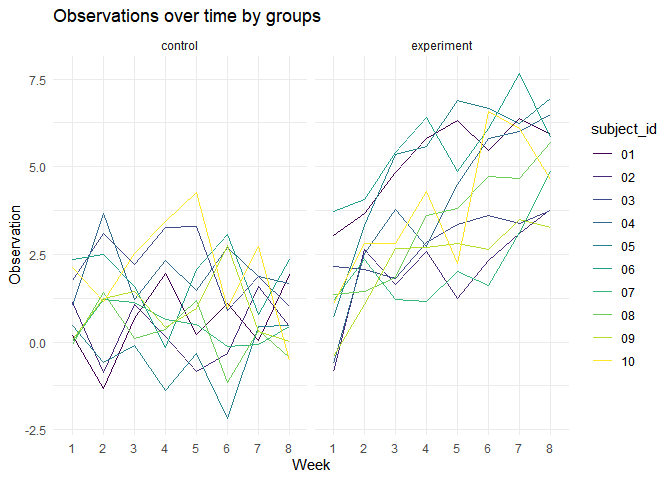
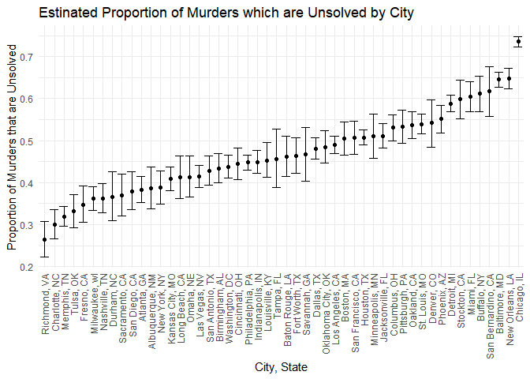
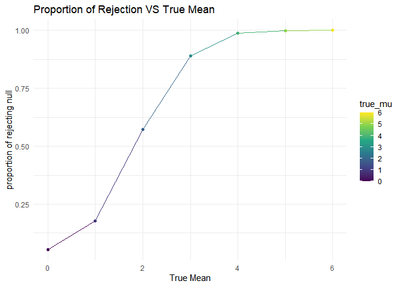
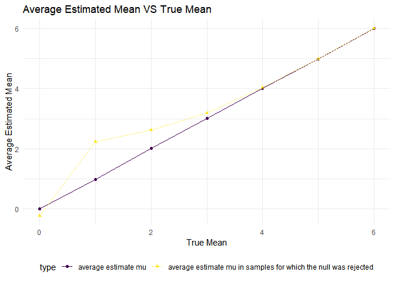

p8105_hw5_rc3521
================
Runze Cui
2022-11-09

## Problem 1

Read and tidy data from the given longitudinal study

``` r
files = list.files("./data", pattern = ".csv", all.files = FALSE, full.names = FALSE)

df = data.frame(participants = files) %>% 
  mutate(file_contents = purrr::map(participants, ~ read.csv(file.path("./data", .)))) %>% 
  separate(participants, into = c("control", "subject_id")) %>% 
  unnest(file_contents) %>% 
  mutate(
    control = recode(control, `con` = "control", `exp` = "experiment")
) 
```

Spaghetti plot

``` r
df %>%  
  pivot_longer(week_1:week_8,
               names_to = "week",
               names_prefix = "week_",
               values_to = "observation") %>%
  ggplot(aes(x = week, y = observation, group = subject_id, color = subject_id)) +
  geom_path() + 
  facet_grid(~control) +
  labs(
    title = "Observations over time by groups",
    x = "Week",
    y = "Observation"
  ) + 
  viridis::scale_color_viridis(discrete = TRUE) + 
  theme(legend.position = "right")
```

<!-- -->

## Problem 2

Read the homicides data:

``` r
urlfile = "https://raw.githubusercontent.com/washingtonpost/data-homicides/master/homicide-data.csv"
homicides_df = read_csv(url(urlfile), na = c(" ", "Unknown")) 
```

    ## Warning: One or more parsing issues, call `problems()` on your data frame for details,
    ## e.g.:
    ##   dat <- vroom(...)
    ##   problems(dat)

    ## Rows: 52179 Columns: 12
    ## ── Column specification ────────────────────────────────────────────────────────
    ## Delimiter: ","
    ## chr (8): uid, victim_last, victim_first, victim_race, victim_sex, city, stat...
    ## dbl (4): reported_date, victim_age, lat, lon
    ## 
    ## ℹ Use `spec()` to retrieve the full column specification for this data.
    ## ℹ Specify the column types or set `show_col_types = FALSE` to quiet this message.

Description: The `homicide` data contains 52,179 observations in 12
columns. Some variables such as `reported-date`, `victim_age` and `city`
recorded really significant information on each observation of criminal
homicides.

Now, create new variables `city_state` and we can see the number of
total murders and unsolved murders based on `city_state` variable.

``` r
homicides_df =
  homicides_df %>%
  mutate(city_state = str_c(city, state, sep = ", "),
         resolution = case_when(
           disposition == "Closed without arrest" ~ "unsolved",
           disposition == "Open/No arrest" ~ "unsolved",
           disposition == "Closed by arrest" ~ "solved")) %>%
  relocate(city_state) %>% 
  filter(city_state != "Tulsa, AL")

homicides_df %>%
  group_by(city_state) %>%
  summarize(
    unsolved = sum(resolution == "unsolved"),
    n = n()) %>%
  knitr::kable(col.names = c("City", "Unsolved Murders", "Total Murders"))
```

| City               | Unsolved Murders | Total Murders |
|:-------------------|-----------------:|--------------:|
| Albuquerque, NM    |              146 |           378 |
| Atlanta, GA        |              373 |           973 |
| Baltimore, MD      |             1825 |          2827 |
| Baton Rouge, LA    |              196 |           424 |
| Birmingham, AL     |              347 |           800 |
| Boston, MA         |              310 |           614 |
| Buffalo, NY        |              319 |           521 |
| Charlotte, NC      |              206 |           687 |
| Chicago, IL        |             4073 |          5535 |
| Cincinnati, OH     |              309 |           694 |
| Columbus, OH       |              575 |          1084 |
| Dallas, TX         |              754 |          1567 |
| Denver, CO         |              169 |           312 |
| Detroit, MI        |             1482 |          2519 |
| Durham, NC         |              101 |           276 |
| Fort Worth, TX     |              255 |           549 |
| Fresno, CA         |              169 |           487 |
| Houston, TX        |             1493 |          2942 |
| Indianapolis, IN   |              594 |          1322 |
| Jacksonville, FL   |              597 |          1168 |
| Kansas City, MO    |              486 |          1190 |
| Las Vegas, NV      |              572 |          1381 |
| Long Beach, CA     |              156 |           378 |
| Los Angeles, CA    |             1106 |          2257 |
| Louisville, KY     |              261 |           576 |
| Memphis, TN        |              483 |          1514 |
| Miami, FL          |              450 |           744 |
| Milwaukee, wI      |              403 |          1115 |
| Minneapolis, MN    |              187 |           366 |
| Nashville, TN      |              278 |           767 |
| New Orleans, LA    |              930 |          1434 |
| New York, NY       |              243 |           627 |
| Oakland, CA        |              508 |           947 |
| Oklahoma City, OK  |              326 |           672 |
| Omaha, NE          |              169 |           409 |
| Philadelphia, PA   |             1360 |          3037 |
| Phoenix, AZ        |              504 |           914 |
| Pittsburgh, PA     |              337 |           631 |
| Richmond, VA       |              113 |           429 |
| Sacramento, CA     |              139 |           376 |
| San Antonio, TX    |              357 |           833 |
| San Bernardino, CA |              170 |           275 |
| San Diego, CA      |              175 |           461 |
| San Francisco, CA  |              336 |           663 |
| Savannah, GA       |              115 |           246 |
| St. Louis, MO      |              905 |          1677 |
| Stockton, CA       |              266 |           444 |
| Tampa, FL          |               95 |           208 |
| Tulsa, OK          |              193 |           583 |
| Washington, DC     |              589 |          1345 |

Filter to Baltimore and `prop_test`

``` r
baltimore_df =
  homicides_df %>%
  filter(city_state == "Baltimore, MD")

baltimore_summary =
  baltimore_df %>%
  summarise(
    unsolved = sum(resolution == "unsolved"),
    n = n()
  )

baltimore_test =
  prop.test(
  x = baltimore_summary %>% 
    pull(unsolved),
  n = baltimore_summary %>% 
    pull(n)
) %>% 
  broom::tidy()

baltimore_test
```

    ## # A tibble: 1 × 8
    ##   estimate statistic  p.value parameter conf.low conf.high method        alter…¹
    ##      <dbl>     <dbl>    <dbl>     <int>    <dbl>     <dbl> <chr>         <chr>  
    ## 1    0.646      239. 6.46e-54         1    0.628     0.663 1-sample pro… two.si…
    ## # … with abbreviated variable name ¹​alternative

Make a iteration function for the to `prop_test` the whole
`homicides_df` data frame

``` r
prop_test_function =
  function(city_df) {
  
city_summary =
  city_df %>%
  summarise(
  unsolved = sum(resolution == "unsolved"),
  n = n()
  )

city_test = 
  prop.test(
  x = city_summary %>% 
    pull(unsolved),
  n = city_summary %>% 
    pull(n))
return(city_test)
}

prop_test_function(baltimore_df)
```

    ## 
    ##  1-sample proportions test with continuity correction
    ## 
    ## data:  city_summary %>% pull(unsolved) out of city_summary %>% pull(n), null probability 0.5
    ## X-squared = 239.01, df = 1, p-value < 2.2e-16
    ## alternative hypothesis: true p is not equal to 0.5
    ## 95 percent confidence interval:
    ##  0.6275625 0.6631599
    ## sample estimates:
    ##         p 
    ## 0.6455607

``` r
results =
  homicides_df %>%
  nest(data = uid:resolution) %>%
  mutate(
    test_results = map(data, prop_test_function),
    tidy_results = map(test_results, broom::tidy)
  ) %>%
  select(city_state, tidy_results) %>%
  unnest(tidy_results) %>%
  select(city_state, estimate, starts_with("conf"))

results
```

    ## # A tibble: 50 × 4
    ##    city_state      estimate conf.low conf.high
    ##    <chr>              <dbl>    <dbl>     <dbl>
    ##  1 Albuquerque, NM    0.386    0.337     0.438
    ##  2 Atlanta, GA        0.383    0.353     0.415
    ##  3 Baltimore, MD      0.646    0.628     0.663
    ##  4 Baton Rouge, LA    0.462    0.414     0.511
    ##  5 Birmingham, AL     0.434    0.399     0.469
    ##  6 Boston, MA         0.505    0.465     0.545
    ##  7 Buffalo, NY        0.612    0.569     0.654
    ##  8 Charlotte, NC      0.300    0.266     0.336
    ##  9 Chicago, IL        0.736    0.724     0.747
    ## 10 Cincinnati, OH     0.445    0.408     0.483
    ## # … with 40 more rows

Make a plot of estimate and error bar for each city of our data frame.

``` r
results %>%
  mutate(city_state = fct_reorder(city_state, estimate)) %>%
  ggplot(aes(x = city_state, y = estimate)) +
  geom_point() +
  geom_errorbar(aes(ymin = conf.low, ymax = conf.high)) +
  theme(axis.text.x = element_text(angle = 90, vjust = 0.5, hjust = 1)) +
  labs(
    x = "City, State",
    y = "Proportion of Murders that are Unsolved",
    title = "Estinated Proportion of Murders which are Unsolved by City"
  )
```

<!-- -->

## Problem 3

Do a hypothesis T test for $n = 30$ and $\sigma = 5$. The model follows
normal distribution.

Set $\mu = 0$

Create a 5000 dataset for $\mu = 0$

``` r
sim_mean_sd = function(n_obs, mu = 0, sigma = 5) {
  
  x = rnorm(n = n_obs, mean = mu, sd = sigma)
  t.test(x, n = n_obs, conf.level = 0.95)
  
}

output = vector("list", length = 5000)
for (i in 1:5000) {
  
  output[[i]] = sim_mean_sd(n_obs = 30) %>% 
    broom::tidy() %>% 
    select(estimate, p.value)
}

bind_rows(output)
```

    ## # A tibble: 5,000 × 2
    ##    estimate p.value
    ##       <dbl>   <dbl>
    ##  1   -0.749   0.339
    ##  2   -1.64    0.129
    ##  3    0.935   0.291
    ##  4    0.443   0.651
    ##  5    0.367   0.690
    ##  6   -0.354   0.723
    ##  7   -0.200   0.837
    ##  8   -0.839   0.270
    ##  9    0.529   0.586
    ## 10    0.545   0.525
    ## # … with 4,990 more rows

Now we repeat above for $\mu = 1, 2, 3, 4, 5, 6$

``` r
sim_results_df = 
  expand_grid(
    sample_size = 30,
    true_mu = c(0, 1, 2, 3, 4, 5, 6),
    iteration = 1:5000
  ) %>% 
  mutate(
    estimate_df = 
      map2(.x = sample_size, .y = true_mu, ~broom::tidy(sim_mean_sd(n_obs = .x, mu = .y)))
  ) %>% 
  unnest(estimate_df) %>% 
  select(true_mu, estimate, p.value) 

sim_results_stat = 
  sim_results_df %>% 
  group_by(true_mu) %>% 
  summarize(
    n = n(),
    n_reject = sum(p.value < 0.05),
    proportion = n_reject / n
  ) %>% 
  rbind()
sim_results_stat
```

    ## # A tibble: 7 × 4
    ##   true_mu     n n_reject proportion
    ##     <dbl> <int>    <int>      <dbl>
    ## 1       0  5000      273     0.0546
    ## 2       1  5000      887     0.177 
    ## 3       2  5000     2863     0.573 
    ## 4       3  5000     4453     0.891 
    ## 5       4  5000     4939     0.988 
    ## 6       5  5000     4997     0.999 
    ## 7       6  5000     5000     1

Make a plot showing the proportion of times the null was rejected

``` r
sim_results_stat %>% 
  ggplot(aes(x = true_mu, y = proportion, color = true_mu)) + 
  geom_point() + 
  geom_line() + 
  labs(
    x = "True Mean",
    y = "proportion of rejecting null",
    title = "Proportion of Rejection VS True Mean"
  )
```

<!-- -->

Based on the plot above, we can see that the proportion of rejecting
null increases and gradually approaches one as the true mean grows,
which means the power of the one-sample t-test increases as the true
value of $\mu$ increases. Based on the knowledge, the statistical power
will be associated with both effect size and sample size with a
relatively trade-off relationship.

``` r
mu_ave = 
  sim_results_df %>% 
  group_by(true_mu) %>% 
  summarize(
    type = "average estimate mu",
    ave_est_mu = mean(estimate)
  )

rej_mu_ave = 
  sim_results_df %>% 
  filter(p.value < 0.05) %>% 
  group_by(true_mu) %>% 
  summarize(
    type = "average estimate mu in samples for which the null was rejected",
    ave_est_mu = mean(estimate)
  )

mu_ave %>% 
  rbind(rej_mu_ave) %>% 
  ggplot(aes(x = true_mu, y = ave_est_mu, group = type, color = type)) + 
  geom_point(aes(shape = type)) + 
  geom_line(aes(linetype = type)) + 
  labs(
    x = "True Mean",
    y = "Average Estimated Mean",
    title = "Average Estimated Mean VS True Mean"
  ) + 
  theme(legend.position = "bottom")
```

<!-- -->

At the beginning of the plot, we clearly see that the sample average of
estimated $\hat\mu$ across tests for which the null is rejected slightly
differ to the true value of $\mu$ and tends to be equal to each other as
true mean value increasing. But in general, we can say the sample
average of estimated mu across tests for which the null is rejected is
approximately equal to the true value of $\mu$. Since in this study, we
generate 5,000 dataset for each value of $\mu$. The sample size is quite
large and we can detect differences that are quite small and possibly
trivial.
